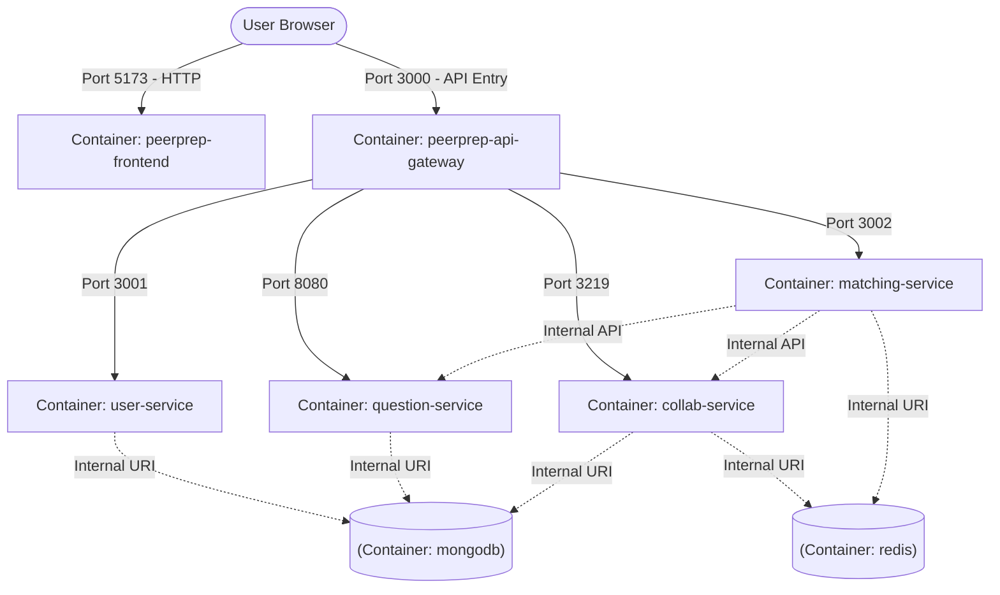

# PeerPrep Containerization Report

This document outlines the containerization strategy and local deployment process for the PeerPrep microservices architecture.

## 1. Containerization Coverage

The entire PeerPrep system is orchestrated using a single **`docker-compose.yml`** file. This ensures that all services, including back-end microservices, the front-end, and database dependencies, can be started with a single command.

### Services Included:
*   **Back-end Microservices**:
    *   `user-service`: Handles user authentication and profiles.
    *   `question-service`: Manages the bank of technical interview questions.
    *   `collab-service`: Manages real-time collaborative editing sessions and chat.
    *   `matching-service`: Manages finding available peers and pairing them together.
*   **Internal Infrastructure**:
    *   `api-gateway`: Unified entry point that proxies requests to back-end services.
*   **Front-end Application**:
    *   `frontend`: React/Vite-based UI served via Nginx.
*   **Databases**:
    *   `peerprep-mongodb`: Local MongoDB instance (optional, switchable to Cloud Atlas).
    *   `peerprep-redis`: In-memory data store for collaboration state.

### Starting the System:
To start the entire system, run the following command from the root directory:

```bash
docker compose up --build
```

---

## 2. Dockerfile Strategy

A standardized strategy was applied to all microservices to ensure small, secure, and production-ready images.

### Key Strategies:
1.  **Choice of Base Image (`node:20-alpine`)**:
    *   **Lightweight**: Alpine Linux significantly reduces the image size (from ~1GB to ~150MB).
    *   **Security**: Smaller attack surface due to fewer pre-installed packages.
2.  **Multi-Stage Builds**:
    *   **Stage 1 (Builder)**: Installs all dependencies (including `devDependencies`) and compiles source code where necessary (e.g., `frontend` build).
    *   **Stage 2 (Runtime)**: Copies only the necessary application context and production `node_modules`. This keeps the final image clean of build-time artifacts and source control junk.
3.  **Cross-Platform Resolution**:
    *   Since local development on macOS creates a `package-lock.json` with OS-specific binaries (like `@rollup/rollup-linux-arm64-musl`), the `frontend/Dockerfile` specifically avoids `npm ci` and runs `RUN rm -f package-lock.json && npm install`. This recreates the lockfile using the necessary Linux binaries directly within the container context.
4.  **Context Optimization**:
    *   **`.dockerignore`**: We use this to prune the "Build Context" (the files Docker sees).
        *   **Excluding `.git`**: We block the `.git` folder to avoid **Context Bloat**. This reduces the data Docker has to process from hundreds of MBs to just a few KBs, making builds nearly 10x faster.
        *   **Excluding `node_modules`**: We block local `node_modules` to prevent **Architecture Mismatch**. Since your Mac uses different binaries than the Linux container, copying them would cause the app to crash. This forces a fresh, compatible `npm install` inside the container.
        *   **Including `frontend/.env`**: Notably, `frontend/.env` is deliberately **excluded** from the `.dockerignore` list. This ensures it is copied into the container so Vite can "bake" your API settings into the final website.
5.  **Health Checks**:
    *   Custom `healthcheck` commands were added to the `mongodb` and `redis` services (see [docker-compose.yml](file:///Users/cjaycee/Documents/peerprep-g08/docker-compose.yml)). The microservices are configured to wait until these health checks pass (`condition: service_healthy`) before attempting to connect, preventing "Connection Refused" errors on startup.

---

## 3. Inter-service Communication

The services communicate seamlessly using **Docker's Internal DNS** and a dedicated bridge network.

### Architecture Overview:



> [!TIP]
> **Legend:**
> *   **Solid Boxes (Top Layer)**: Public-facing services that users interact with.
> *   **Nested Boxes (Microservices)**: Core logic containers that manage specific parts of the app.
> *   **Cylinder Shapes (Data Layer)**: Persistent and temporary data storage.

### Key Technical Details:
*   **Internal DNS**: Containers talk to each other using their names as "URLs".
    *   *Example*: `http://matching-service:3002` works because Docker maps the name to the internal IP automatically.
*   **Zero-Intervention Config**: All settings are in [service-level .env files](file:///Users/cjaycee/Documents/peerprep-g08/user-service/.env). We removed hardcoded overrides from [docker-compose.yml](file:///Users/cjaycee/Documents/peerprep-g08/docker-compose.yml) so you can switch between local and cloud databases just by editing the `.env`.
*   **WebSocket Handling**: The [api-gateway/index.js](file:///Users/cjaycee/Documents/peerprep-g08/api-gateway/index.js) is configured to handle "Upgrades," ensuring real-time features like Matching and Chat work through the single gateway port (3000).
*   **Build-Time Injection**: For the frontend, settings are "baked in" during the build. If you change a `VITE_` variable, you must run `docker compose build frontend` to see the update.

---

## 4. Current Constraints & Future Improvements

While the current containerization is robust for local development, we identified several areas for potential optimization:

1.  **Frontend Build Latency**: Since environment variables are injected at build-time, any configuration change requires a full rebuild (~2-3 mins). A **Runtime Injection Script** inside Nginx could resolve this by replacing placeholders in the compiled JS upon container start.
2.  **Database Seeding**: The system currently starts with a "clean slate." A dedicated **Seeder Container** could be implemented to automatically populate initial questions and test users, ensuring the Matching Service works end-to-end immediately upon first run.
3.  **Secret Management**: Using plain-text `.env` files is convenient for local dev but insecure for production. Transitioning to **Docker Secrets** or a dedicated manager (like Vault) would be the next step for a production-ready deployment.
4.  **Observability**: We currently rely on standard Docker logs. Integrating a unified logging system (like **ELK Stack** or **Prometheus/Grafana**) would provide better visibility into inter-service latency and failures.
